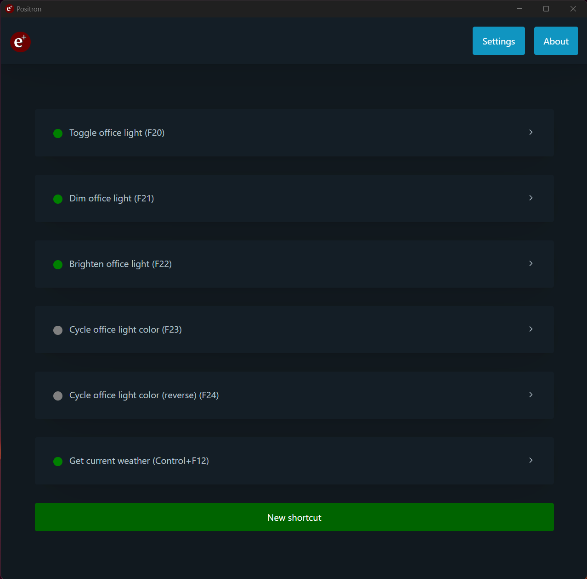
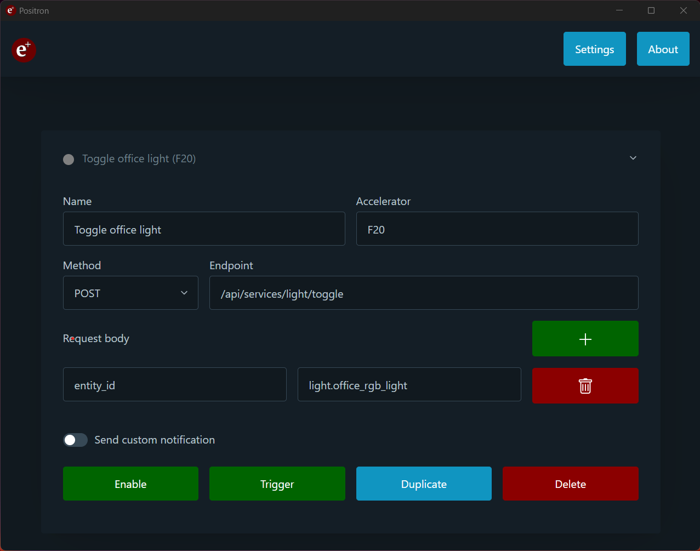
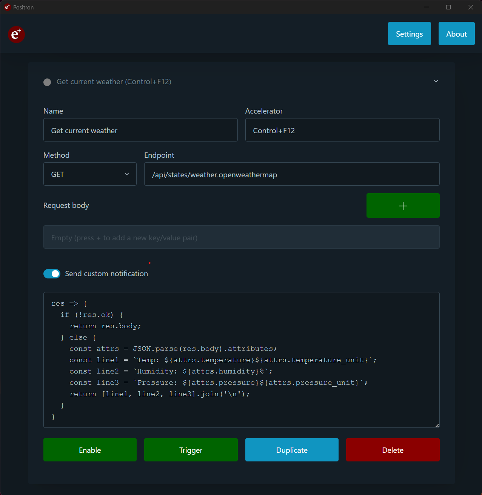
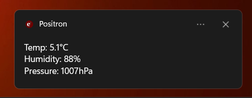
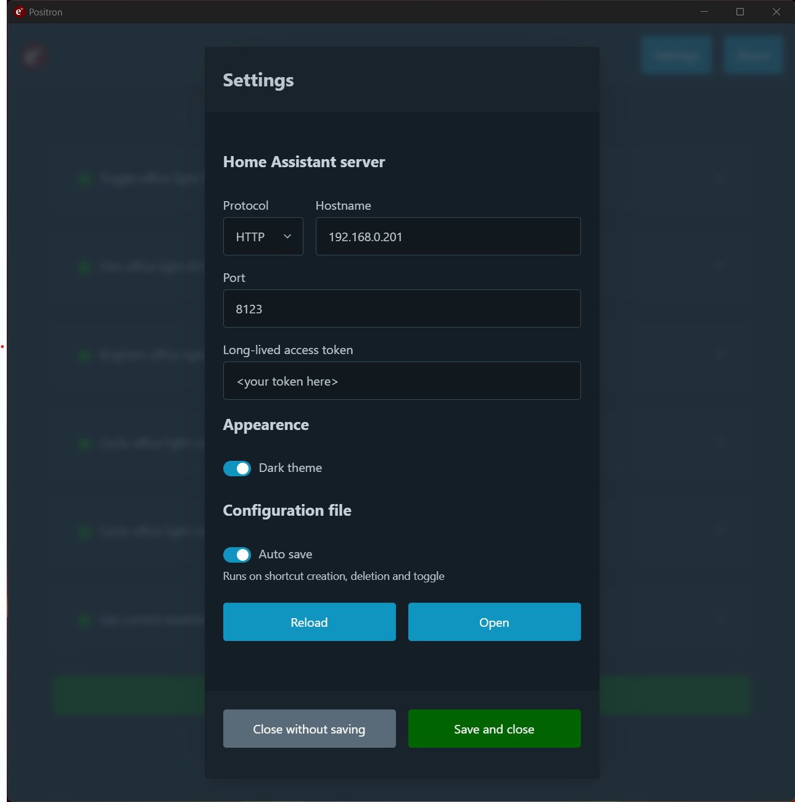

<div style="text-align: center">
  
  <h2>Positron</h2>
  <h3>Create keyboard shortcuts for Home Assistant actions</h3>
</div>

---

Positron let's you associate global system shortcuts to requests to a [Home
Assistant](https://www.home-assistant.io/) server. You can use this to toggle
ligths, enable scenes, run scripts, read sensors, and pretty much anything Home
Assistant supports!


## Features

* Multiplatform: available for Windows, macOS and Linux (both `deb` and `rpm`
  packages).

* Associate keyboard shortcuts to HTTP requests to a Home Assistant server endpoint.

  + Shortcuts are handled directly by Electron, and you can define any combination of keys supported by its [Accelerator API](https://www.electronjs.org/docs/latest/api/accelerator).

  + The supported endpoints are described in the Home Assistant [REST API](https://developers.home-assistant.io/docs/api/rest/) documentation.

  + Send request data: some endpoints require JSON data to be sent in the request body. Positron lets you add this data using key/value pairs.

* Custom notification handlers: if your request returns some useful data, you can write a custom response handler to get a system notification when the shortcut is triggered. This can be used to, for instance, get the state of a sensor or read events.

  + To implement a custom notification handler, you simply need provide an anonymous function of type:

    `{ ok: boolean, body: string } => string`

    The `ok` field indicates if the requests was successful, and `body` contains the raw data that the Home Assistant server replied with or an error message. The return value of this function should be content of the body of your custom notification. For instance, the default custom notification handler is:

    `res => res.ok ? 'Ok' : res.body`

  + NOTE: This uses Electron's `vm` module to run your custom code. This provides some isolation so you don't shoot yourself in the foot, but it has been proven not to be a _secure_ isolation mechanism. Keep your handler simple and, needless to say, don't run code you don't trust here.

* Manually trigger the request and see the response. Useful for debugging custom notification handlers.

* Automatically minimizes to the system tray.

* Automatically save your configuration after changes.

* Dark/light mode switch.

## Setup

After you first launch this app, you can setup your Home Assistant server
details under the `Settings` page. You'll need:

* A Home Assistant server URL (http/https, hostname, port)
* A [long-lived access token](https://developers.home-assistant.io/docs/auth_api/#long-lived-access-token)

## Screenshots

### Homepage

<div style="text-align: center">
  
</div>

### Creating shortcuts

<div style="text-align: center">
  
</div>

### Custom notification handlers

<div style="text-align: center">
  
</div>

### Custom notifications

<div style="text-align: center">
  
</div>

### Settings menu

<div style="text-align: center">
  
</div>

## Install

### Precompiled releases

The easiest way to install this app is to grab one of the [precompiled releases](https://github.com/agustinmista/positron/releases).

NOTE: the release binaries are **not signed**, so you might see Windows and macOS complaining about them. This is not going to change unless this app gets some traction, since both Microsoft and Apple charge you a fair amount of real money to let you become a trusted developer.

  * On windows, if you see the `Windows protected your PC` popup, you can continue by clicking in `More info` and the `Run anyway`.

  * On macOS, you might need to [allow apps from unidentified developers](https://support.apple.com/guide/mac-help/open-a-mac-app-from-an-unidentified-developer-mh40616/mac).

### Build from source

You can also build Positron by yourself. Assumming you have `git` and `npm` installed, this should get you far:

```
git clone https://github.com/agustinmista/positron.git
cd positron
npm install
npm start     # starts the app
npm run make  # packages a binary/installer
```

Please report any issue you might encounter while building the app and I will update this file accordingly.

## Contributing

Feel free to [open an issue](https://github.com/agustinmista/positron/issues/new) if you find a bug or if you'd like to see a new feature implemented.

PRs are welcomed too!

## License

MIT License

Copyright (c) 2023 Agustín Mista
